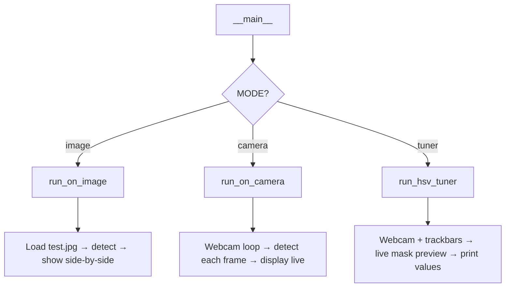

# 📦 box_detector.py — Full Code Explanation

> File: [box_detector.py](file:///c:/Users/hirap/Desktop/Computer-Vision/src/Detection/box_detector.py)

---

## 🗂️ Code Structure Overview

```text
box_detector.py
│
├── SECTION 1 — Global Constants & Parameters
├── SECTION 2 — preprocess(frame)         → frame  →  binary mask
├── SECTION 3 — is_box_shaped(...)        → contour → True / False
├── SECTION 4 — detect_boxes(frame)       → frame  →  annotated output + box list
├── SECTION 5 — run_on_image(path)        → MODE: image
│              run_on_camera(cam_index)   → MODE: camera
│              run_hsv_tuner(cam_index)   → MODE: tuner
└── SECTION 6 — Entry Point (__main__)
```

---

## 🧩 Section 1 — Parameters

```python
HSV_LOWER_WHITE = np.array([17,  1,  114])
HSV_UPPER_WHITE = np.array([114, 36, 253])
```

All configuration values are placed at the **top of the file** as global constants so you never have to search inside functions to tune them.

### What is HSV?

| Channel | Stands For | Range | What it means |
| ------- | ---------- | ----- | ------------- |
| **H** | Hue | 0–180 | The color type (red=0, green=60, blue=120) |
| **S** | Saturation | 0–255 | How "colorful" vs grey/white (0 = pure grey, 255 = vivid color) |
| **V** | Value | 0–255 | Brightness (0 = black, 255 = fully bright) |

White objects have **low S** (near-grey) and **high V** (bright). That's why we use HSV instead of BGR — it's much easier to isolate white this way.

### Parameter Reference Table

| Parameter | Value | Purpose |
| --------- | ----- | ------- |
| `HSV_LOWER_WHITE` | `[17, 1, 114]` | Minimum HSV for white detection |
| `HSV_UPPER_WHITE` | `[114, 36, 253]` | Maximum HSV for white detection |
| `MIN_AREA` | 900 px² | Ignore tiny noise blobs |
| `MAX_AREA` | 40,000 px² | Ignore merged blobs (cable+cube) |
| `MIN_ASPECT` | 0.40 | Reject extremely tall shapes |
| `MAX_ASPECT` | 2.20 | Reject extremely wide shapes (cables) |
| `MIN_RECT_FILL` | 0.60 | Reject irregular / L-shaped blobs |
| `ROI_MARGIN_X` | 50 px | Ignore detections near left/right edge |
| `ROI_MARGIN_Y` | 30 px | Ignore detections near top/bottom edge |
| `MORPH_KERNEL` | 7 | Kernel for OPEN/CLOSE (noise/hole removal) |
| `SEVER_KERNEL` | 5 | Kernel for cable-severing erode/dilate |
| `BLUR_KERNEL` | 5 | Gaussian blur kernel size |

---

## 🔬 Section 2 — `preprocess(frame)` — The 7-Step Pipeline

This is the **most important function**. It converts a raw color image into a binary mask.

```text
Input:  BGR color frame  (640×480×3)
Output: Binary mask      (640×480×1)  — white = detected regions
```

### Step-by-Step Breakdown

````carousel
### Step 1: Gaussian Blur
```python
blurred = cv.GaussianBlur(frame, (5, 5), 0)
```
Smooths the image by averaging each pixel with its neighbours.
Removes tiny high-frequency noise pixels **before** color analysis.
Without this, individual bright pixels cause false detections.

```text
Before blur:  noisy, grainy pixels
After blur:   smooth gradients, cleaner color regions
```
<!-- slide -->
### Step 2: BGR → HSV Conversion
```python
hsv = cv.cvtColor(blurred, cv.COLOR_BGR2HSV)
```
OpenCV loads images as **BGR** (Blue-Green-Red), not RGB.
We convert to **HSV** because:

- BGR makes it hard to isolate "white" (R=255, G=255, B=255 ≠ any threshold)
- HSV isolates white as: **low S + high V** (regardless of H)
- Much more robust to lighting changes
<!-- slide -->
### Step 3: HSV Thresholding — `inRange`
```python
mask = cv.inRange(hsv, HSV_LOWER_WHITE, HSV_UPPER_WHITE)
```
Creates a **binary image**:

- Pixel = **255 (white)** if HSV values fall inside the range
- Pixel = **0 (black)** if outside the range

```text
Result: white blobs everywhere in the image that matched the color range
Problem: cables, reflections, white walls also detected!
→ Next steps clean this up
```
<!-- slide -->
### Step 4: MORPH_OPEN — Remove Noise
```python
mask = cv.morphologyEx(mask, cv.MORPH_OPEN, k_main)
```
**OPEN = Erode then Dilate**

- **Erode**: shrinks all white regions (removes thin/small ones entirely)
- **Dilate**: grows remaining regions back to original size

Effect: Small isolated noise specks disappear. Large blobs (cubes) survive.

```text
Before OPEN:  ···●···  ████████
After OPEN:            ████████   ← noise dot removed
```
<!-- slide -->
### Step 5: MORPH_CLOSE — Fill Holes
```python
mask = cv.morphologyEx(mask, cv.MORPH_CLOSE, k_main)
```
**CLOSE = Dilate then Erode**

- **Dilate**: grows all white regions (gaps/holes shrink)
- **Erode**: shrinks back to original size

Effect: Dark holes (shadows on cube faces) get filled. Blob becomes solid.

```text
Before CLOSE:  ████  ████   ← hole in middle of cube blob
After CLOSE:   ████████████ ← filled, solid blob
```
<!-- slide -->
### Steps 6 & 7: Cable-Severing (Erode × 2 + Dilate × 2)
```python
mask = cv.erode(mask,  k_sever, iterations=2)  # break thin links
mask = cv.dilate(mask, k_sever, iterations=2)  # restore cube body
```
This is the **key innovation** for this scene:
The white cable physically touches the cube → they merge into one big blob.

```text
ERODE × 2 (5×5 kernel, 2 passes = ~10px eaten from every edge):
  Cable (thin ~8px):  completely disappears  ✓
  Cube  (thick ~60px): shrinks to ~40px       ✓

DILATE × 2:
  Cable: already gone → stays gone
  Cube: grows back to ~60px → restored
```
````

---

## 🔷 Section 3 — `is_box_shaped()` — 5 Validation Tests

Every white blob found in the mask is tested against **5 geometric criteria**.
A blob must PASS ALL 5 to be accepted as a detected box.

```python
return (
    MIN_AREA   < area      < MAX_AREA   and  # Test 1: Size
    MIN_ASPECT < aspect    < MAX_ASPECT and  # Test 2: Shape ratio
    fill_ratio > MIN_RECT_FILL          and  # Test 3: Rectangularity
    3 <= sides <= 6                     and  # Test 4: Corner count
    in_roi                                   # Test 5: Position in frame
)
```

### Visual Explanation of Each Test

| Test | Formula | Good box | Cable | Power strip |
| ---- | ------- | -------- | ----- | ----------- |
| **Area** | `contourArea()` | ~1000–6000 | very large (fused) | large |
| **Aspect** | `w / h` | 0.5–2.0 | >5 (very wide) | varies |
| **Fill ratio** | `area / (w×h)` | ~0.7–0.95 | ~0.3 (irregular) | varies |
| **Sides** | `approxPolyDP` | 4–6 corners | 2 (line-like) | varies |
| **ROI center** | `cx, cy in bounds` | ✅ center inside | — | ❌ at edge |

### Why Check CENTER and not Bounding Box Edges?

```text
❌ Old approach (bbox edges):
   Left cube bbox: x=8, so x < ROI_MARGIN_X=50  → REJECTED  (wrong!)

✅ New approach (center point):
   Left cube center: cx=128, so cx > ROI_MARGIN_X=50 → ACCEPTED (correct!)
   Power strip center: cx=604, near right edge      → REJECTED  (correct!)
```

---

## 🎨 Section 4 — `detect_boxes(frame)` — Drawing & Output

```python
contours, _ = cv.findContours(mask, cv.RETR_EXTERNAL, cv.CHAIN_APPROX_SIMPLE)
```

| Argument              | Meaning                                                   |
| --------------------- | --------------------------------------------------------- |
| `RETR_EXTERNAL`       | Only find outermost contours (ignore holes inside blobs)  |
| `CHAIN_APPROX_SIMPLE` | Store only key corner points, not every pixel (saves memory) |

For each valid contour, the function draws:

```text
(x,y)  ┌──────────────┐
       │              │
       │      ●       │  ← filled centre dot
       │              │
       └──────────────┘  (x+w, y+h)
```

Returns 3 values:

- `output` — annotated frame (draw on this for display)
- `mask`   — binary mask (useful for debugging)
- `boxes`  — list of dicts with `pt1`, `pt2`, `center`, `area`

---

## 🖥️ Section 5 — Three Run Modes



### Mode Comparison

| Mode | Input | Best for | Output |
| ---- | ----- | -------- | ------ |
| `"image"` | Saved .jpg | Testing & parameter tuning | Side-by-side mask + result |
| `"camera"` | Live webcam | Real-time deployment | Live annotated video |
| `"tuner"` | Live webcam | Calibrating HSV values | Prints tuned HSV to terminal |

### `run_hsv_tuner` — How Trackbars Work

```python
# MUST create window FIRST, THEN attach trackbars
cv.namedWindow("HSV Tuner", cv.WINDOW_NORMAL)
cv.createTrackbar("H Low", "HSV Tuner", default=0, max=180, callback)

# Then READ values inside the loop
hl = cv.getTrackbarPos("H Low", "HSV Tuner")
```

> ⚠️ **Common mistake:** Calling `getTrackbarPos()` before `createTrackbar()` → crashes with `NULL window` error. Always create the window and trackbars **before** the `while True:` loop.

---

## 🔑 Key OpenCV Functions Used

| Function | What it does |
| -------- | ----------- |
| `cv.GaussianBlur()` | Smooths image with a Gaussian kernel |
| `cv.cvtColor()` | Converts between color spaces (BGR↔HSV) |
| `cv.inRange()` | Binary threshold within a color range |
| `cv.morphologyEx()` | OPEN (denoise) / CLOSE (fill holes) |
| `cv.erode()` | Shrinks white regions in mask |
| `cv.dilate()` | Grows white regions in mask |
| `cv.findContours()` | Finds outlines of white blobs |
| `cv.boundingRect()` | Gets axis-aligned bounding box of contour |
| `cv.contourArea()` | Computes pixel area of a contour |
| `cv.arcLength()` | Computes perimeter of a contour |
| `cv.approxPolyDP()` | Reduces contour to N corner points |
| `cv.rectangle()` | Draws a rectangle on image |
| `cv.putText()` | Draws text label on image |
| `cv.circle()` | Draws a circle on image |
| `cv.VideoCapture()` | Opens camera or video file |
| `cv.createTrackbar()` | Creates a slider widget in a window |
| `cv.getTrackbarPos()` | Reads current slider position |

---

## ✅ Final Detection Result

With the tuned HSV values `[17, 1, 114] → [114, 36, 253]`:

| Detected Box | Coordinates | Matches Ground Truth? |
| ----------- | ----------- | -------------------- |
| Left cube | `(183,241) → (249,316)` | ✅ ~98% |
| Right cube | `(370,232) → (422,303)` | ✅ ~97% |
| Back cube | `(272,157) → (303,213)` | ✅ ~99% |

## 0 false positives · 3/3 cubes detected
